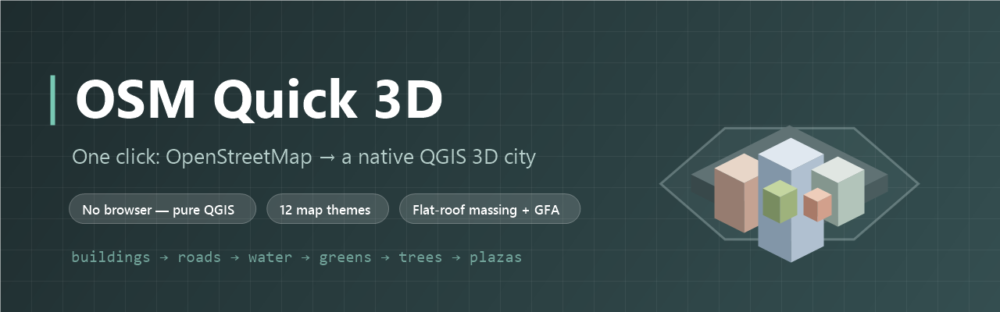

<div align="center">



# OSM Quick 3D

**One click: OpenStreetMap → a native QGIS 3D city.**

[](https://github.com/YusufEminoglu/osm_quick_3d/releases)
[](LICENSE)
[](https://qgis.org)
[](https://www.openstreetmap.org/copyright)

Draw nothing, configure nothing twice. Pick an area, press one button —
**styled 2D layers + a flat-roof 3D massing model land straight in your QGIS project.**
No browser, no web server, no external dependencies.

[Install](#-installation) · [What you get](#-what-you-get) · [Themes](#-12-map-themes) · [Live 3D dock](#-the-dock-build--tune-live) · [vs. osm_3d_model](#-which-one-do-i-want) · [Türkçe](#-türkçe-özet)

</div>

---

## ✨ Why OSM Quick 3D?

| | |
|---|---|
| 🗺 **Real QGIS layers** | Everything arrives as native vector layers in one tidy layer-tree group — analyse, edit, label, export. Nothing is locked inside a viewer. |
| 🏙 **Instant 3D massing** | Buildings extrude with native QGIS 3D symbology. Height from OSM: `coalesce(height, levels × 3, 9)` m, with a 0.5×–5.0× exaggeration slider for low-rise districts. |
| 🎨 **12 map themes, 8 building palettes** | Recolour the whole scene — buildings, roads, water, greens **and** the 3D massing — in one click, from *Muted Planning* to *Vaporwave*. |
| 📐 **Planning quantities included** | Every building carries computed `footprint_m2` and estimated `gfa_m2` columns; the run reports area totals. Ready for quick density checks. |
| 📦 **Survives reloads & rate limits** | Optional one-file GeoPackage save, plus a one-week Overpass disk cache so re-runs open instantly without hammering the public API. |

---

## 🚀 What you get

One click downloads and styles, clipped to your chosen study-area shape
(**rectangle · rounded rectangle · circle · hexagon · your own selected polygon**):

```text
OSM Quick 3D — EPSG:xxxxx           ← one tidy layer-tree group
 ├─ Buildings    categorized by OSM use (residential/commercial/industrial/civic/worship)
 │                + footprint_m2 + gfa_m2 columns, extruded in 3D
 ├─ Roads        by highway class, metric widths (honours OSM width=*)
 ├─ Cycleways    dedicated styling
 ├─ Water        rivers, lakes, ponds, riverbanks — areas filled, ways ribboned
 ├─ Greens       parks, forests, orchards, plus car parks (grey) & plazas (stone)
 ├─ Trees        OSM tree points + procedurally scattered park canopies, 3D spheres
 └─ Ground base  optional recessed plinth the city stands on (theme-tinted)
```

- **Relation multipolygons** are imported — courtyard buildings and complex parks aren't silently dropped.
- An optional **basemap underlay** is moved beneath the city and **visually clipped to the plinth** (inverted-polygon mask), so the 3D view reads as a clean floating island, not a bleeding rectangle.
- Optional **name labels** (white halo) for buildings and roads.
- Boundary clipping uses Multi* geometry types, so split features survive on large areas.

---

## 🎨 12 Map Themes

Each theme recolours buildings, roads, water, greens, the ground base **and the native 3D massing** together:

| | | | |
|---|---|---|---|
| Muted Planning | Tokyo Cyber | Editorial Paper | Nordic Frost |
| Monochrome Noir | Civic Atlas | Mediterranean | Night Print |
| Anime Cel | Desert Dunes | Pastel Candy | Vaporwave |

Building colours are independently selectable — **identical in 2D and 3D** from a single ramp:
*By function* · *By height* · soft tints in **gray / warm / teal / salmon / purple / sand**, with a live gradient preview swatch in the dock.

---

## 🎛 The Dock: build → tune live

A single dockable panel with two tabs:

| Tab | What it does |
|---|---|
| **Build** | Study-area shape & max-area cap, layer toggles, 3D & ground base, basemap underlay, GeoPackage save, Overpass cache controls (incl. *Clear cache*). |
| **Theme & Style** | Live retuning **without re-downloading**: theme preset, building colour mode, height exaggeration, height classification (continuous/discrete/quantile), labels, base depth & transparency, 3D map tile resolution (256–4096 px), per-layer 3D visibility (hide in 3D, keep in 2D), 3D refresh/focus. |

---

## 🤔 Which one do I want?

| | **OSM Quick 3D** *(this plugin)* | [osm_3d_model](https://github.com/YusufEminoglu/osm_3d_model) |
|---|---|---|
| Output | Native QGIS layers + QGIS 3D view | Three.js web viewer (animated, textured) |
| Best for | **Larger areas**, analysis, printing, editing | Presentation scenes, facades, traffic animation |
| Needs a browser | No | Yes (bundled local server) |
| Data lands in your project | ✅ editable vectors | ❌ exported web scene |
| Roofs / vehicles / pedestrians | Flat massing only | ✅ procedural |

Same OpenStreetMap download logic under the hood — pick by deliverable.

---

## 📦 Installation

**From QGIS Plugin Hub** *(recommended)*
> `Plugins → Manage and Install Plugins…` → search **OSM Quick 3D** → Install.

**From ZIP**
> Download the latest zip from [Releases](https://github.com/YusufEminoglu/osm_quick_3d/releases) → `Plugins → Install from ZIP`.

**From source** *(development)*
```text
git clone https://github.com/YusufEminoglu/osm_quick_3d.git
set QGIS_PLUGINPATH=<clone parent dir>   →  restart QGIS
```

| Requirement | Value |
|---|---|
| QGIS | 3.x and 4.x (defensive fallbacks for both; 3D module optional — degrades to styled 2D) |
| Dependencies | None — pure `qgis.core` / `qgis.gui` / `qgis.PyQt` |
| License | [MIT](LICENSE) — data © [OpenStreetMap contributors](https://www.openstreetmap.org/copyright) |

> **Note on area size:** the practical limit is the public **Overpass API**, not QGIS — big requests can be slow or hit element limits. The plugin clamps the requested area about its centre, and the disk cache spares the API on re-runs.

---

## 🧪 Quality

- Headless test harness — `tests/test_pure_logic.py` exercises the pure-Python parsing, floor-count, UTM, width and cache logic without a QGIS install.
- Overpass cache keys are SHA-256; the codebase passes the QGIS Plugin Hub security scan (Bandit) with no High/Medium findings.
- Defensive throughout: missing 3D module, missing labeling API, failed GeoPackage writes — every path degrades gracefully with a clear message instead of a crash.

---

## 🇹🇷 Türkçe Özet

**OSM Quick 3D**, tek tıkla OpenStreetMap verisini **doğrudan QGIS'e** getirir — tarayıcı yok, web sunucusu yok:

- **Çalışma alanı şekli seçilebilir:** dikdörtgen, yuvarlatılmış dikdörtgen, daire, altıgen veya **kendi seçtiğiniz poligon**; tüm veriler bu sınıra kırpılır.
- **İşleve göre stillenmiş katmanlar:** binalar (konut/ticari/sanayi/kamu/ibadet), yollar (OSM sınıfına göre metrik genişlik), su, yeşil alanlar, otoparklar, meydanlar, ağaçlar — tek bir katman grubunda.
- **Yerli QGIS 3D kütle modeli:** bina yükseklikleri OSM'den (`height` → kat sayısı × 3 → 9 m); 0.5×–5.0× yükseklik abartma; ağaçlara 3D tepe taçları; şehrin üzerinde durduğu **zemin kaidesi**.
- **12 harita teması + 8 bina paleti** — 2D ve 3D'de birebir aynı renkler; dock panelinden indirmeden **canlı** ayarlanır.
- **Planlama büyüklükleri hazır:** her binada `footprint_m2` (taban alanı) ve `gfa_m2` (tahmini toplam inşaat alanı) kolonları.
- **GeoPackage kaydı** (proje yeniden açılınca katmanlar kaybolmaz) ve **1 haftalık Overpass disk önbelleği** (aynı alanda tekrar çalıştırma anında açılır).

Kurulum: QGIS → *Eklentiler → Eklentileri Yönet ve Kur* → **OSM Quick 3D** aratın.

---

## 🧩 Part of the PlanX ecosystem

This plugin is one of 15 open-source QGIS plugins for urban planning by the same author:

| Planning & analysis | CAD & production | 3D & visualization |
|---|---|---|
| [PlanX](https://github.com/YusufEminoglu/PlanX) — spatial-planning suite | [PlanX CAD Toolset](https://github.com/YusufEminoglu/PlanX-CAD) — drafting-grade CAD | [PlanX 3D City](https://github.com/YusufEminoglu/planx_3d_city) — Three.js city viewer |
| [GeoStats Lab](https://github.com/YusufEminoglu/planx_geostats) — spatial statistics | [EasyFillet](https://github.com/YusufEminoglu/EasyFillet) — tangent-arc fillet | [3D OSM Model](https://github.com/YusufEminoglu/osm_3d_model) — OSM → 3D city in browser |
| [Suitability Lab](https://github.com/YusufEminoglu/planx_suitability_lab) — raster MCDA | [Settlement Toolset](https://github.com/YusufEminoglu/PlanX-Settlement) — 9-stage settlement plans | [OSM Quick 3D](https://github.com/YusufEminoglu/osm_quick_3d) — OSM → native QGIS 3D |
| [DataCube Lab](https://github.com/YusufEminoglu/planx_datacube) — spatiotemporal cubes | [UIP Toolset](https://github.com/YusufEminoglu/PlanX-UIP) — Turkish master-plan automation | [Urban Procedural 3D](https://github.com/YusufEminoglu/planx_urban_procedural_3d) — parametric zoning lab |
| [Urban Resilience](https://github.com/YusufEminoglu/planx_urban_resilience) — 28 resilience tools | [ParcelFlux](https://github.com/YusufEminoglu/parcelflux) — parcel subdivision | [CartoLab](https://github.com/YusufEminoglu/planx_cartolab) — publication cartography |

---

## 🤝 Contributing & Support

- 🐛 **Bugs / requests** → [Issues](https://github.com/YusufEminoglu/osm_quick_3d/issues)
- 📜 **Changelog** → [CHANGELOG.md](CHANGELOG.md) follows *Keep a Changelog*
- ✅ Before a PR: run `py -3 tests/test_pure_logic.py` (headless, no QGIS required)

## 👤 Author

**Yusuf Eminoğlu** — urban planner & developer
[GitHub](https://github.com/YusufEminoglu) · yusuf.eminoglu@deu.edu.tr

<div align="center">
<sub>Map data © OpenStreetMap contributors. If OSM Quick 3D saves you an afternoon, a ⭐ helps others find it.</sub>
</div>
